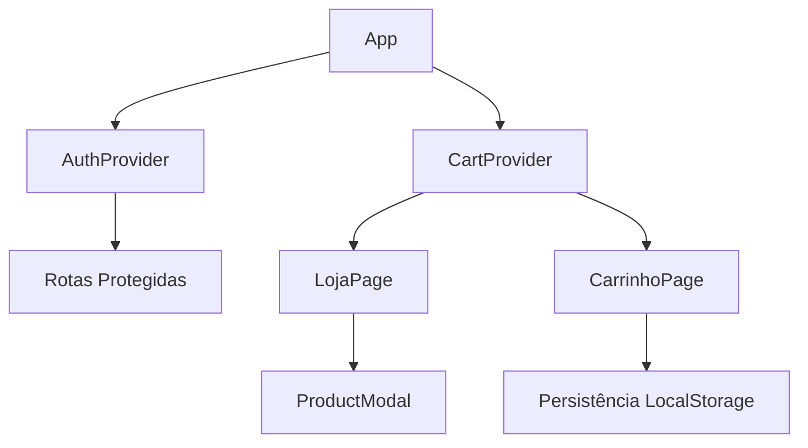

# Projeto Front-end com React [25E1_3] 🚀

Este projeto foi desenvolvido para o curso **Front-end com React [25E1_3]** e implementa uma loja virtual completa com
carrinho de compras persistente.

## 📌 Sobre o Projeto

O projeto apresenta um e-commerce funcional com sistema de autenticação, gerenciamento de estado avançado e persistência
de dados. Utilizamos **Bootstrap** e **Reactstrap** para a interface e **React Context API** para gerenciamento global
de estado.

### 🛍️ Funcionalidades Principais

#### 🔒 Loja Virtual (rota protegida)

- **Catálogo de produtos** com paginação
- **Visualização detalhada** em modal
- **Carrinho persistente** (sobrevive a atualizações)
    - ✅ Adicionar/remover itens
    - 🔢 Ajustar quantidades
    - 🧹 Limpar carrinho
    - 💰 Cálculo automático de totais
    - 🛒 Badge de contagem no header
- **Checkout simulado**

#### 👥 Users List (rota protegida)

- Listagem de usuários
- Exemplo de rota protegida

#### 📋 Outras Rotas

- **Todo**: Gerenciador de tarefas (exemplo didático)

## 🛠 Arquitetura Avançada



## 🚀 Tecnologias Utilizadas

- **React** (v18+)
- **React Router** (v6)
- **Reactstrap** + **Bootstrap 5**
- **Context API** + **useReducer**
- **LocalStorage** (persistência)
- **React Hooks** (useState, useEffect, useContext)

## 🛠 Como Executar o Projeto

### 1️⃣ Pré-requisitos

- Node.js (v16+)
- NPM (v8+) ou Yarn

### 2️⃣ Instalação

```sh
npm install
# ou
yarn install
```

### 3️⃣ Ambiente de Desenvolvimento

```sh
npm start
# Acesse: http://localhost:3000
```

### 4️⃣ Build para Produção

```sh
npm run build
```

## 🎯 Melhorias Futuras

- [ ] Integração com API real
- [ ] Paginação server-side
- [ ] Filtros e busca
- [ ] Dark mode

## 📄 Licença

Este projeto é para fins educacionais, desenvolvido como parte do curso Front-end com React.

---
👨‍💻 **Aluno:** João Victor
